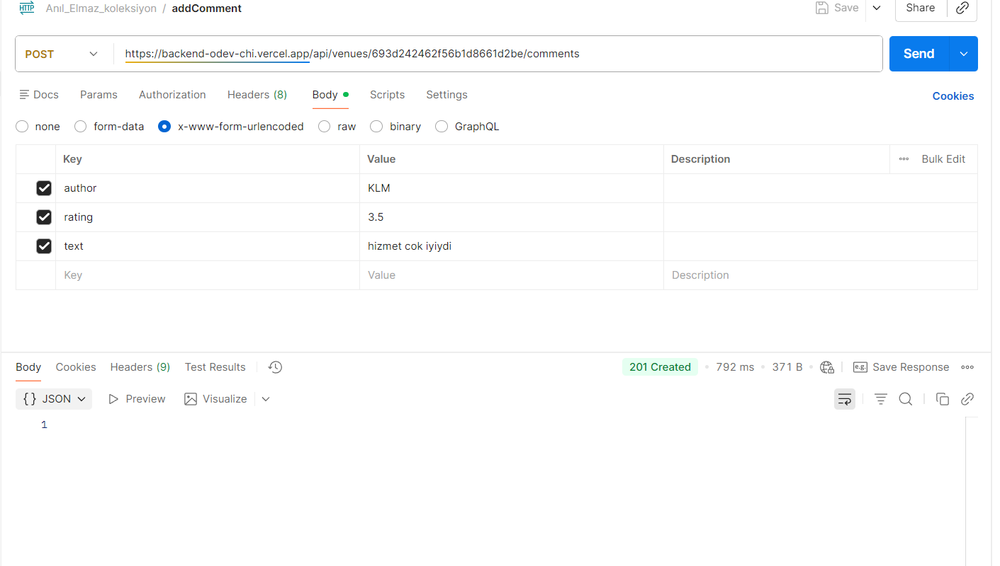
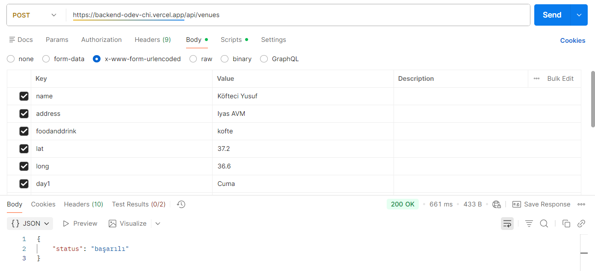
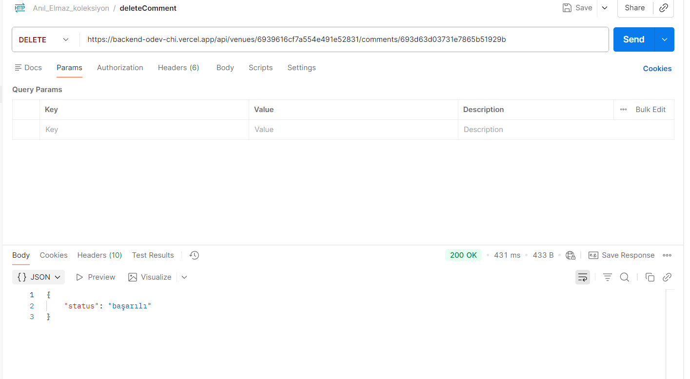
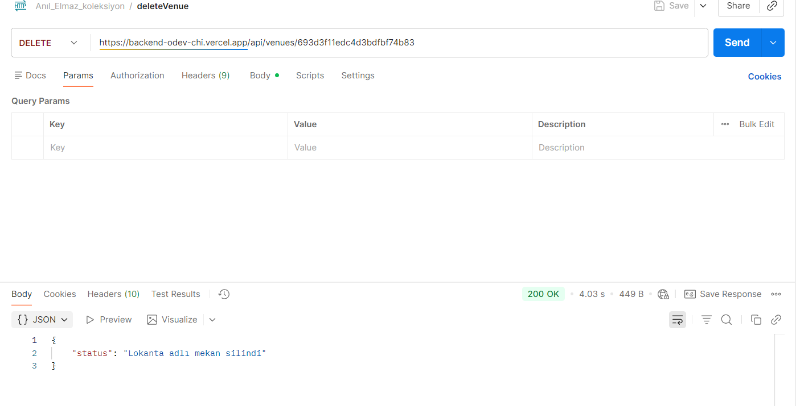
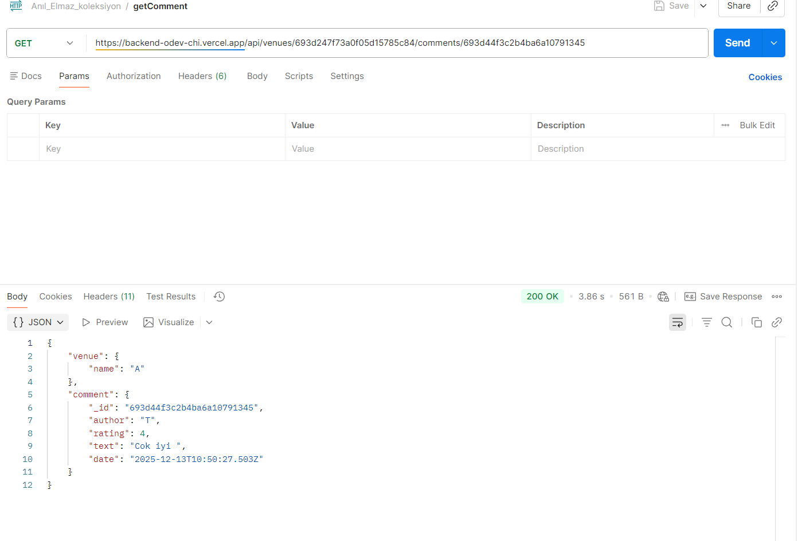
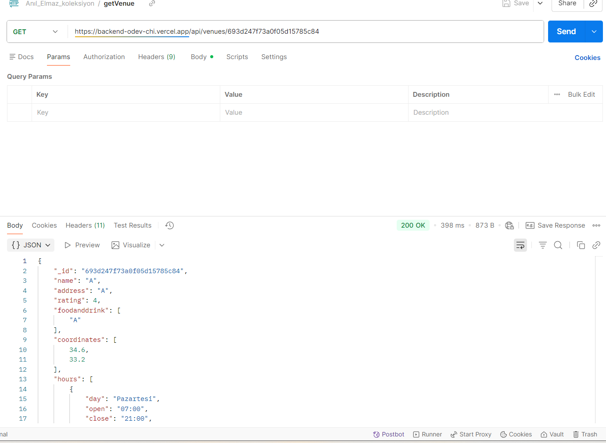
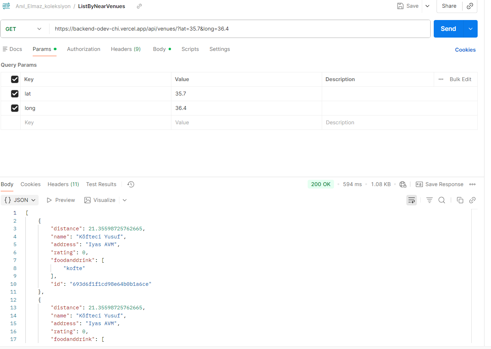
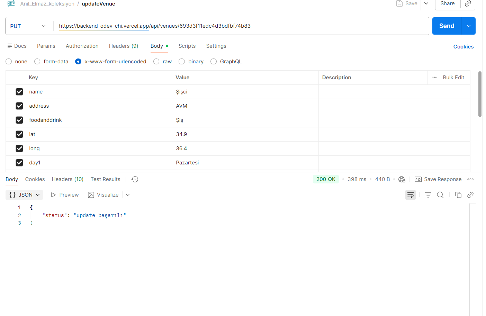

## Express Js Altyapılı Backend Uygulaması
 Canlı URL: [https://backend-odev-chi.vercel.app/]

###  ⚙️ Kurulum
Uygulamayı yerel olarak çalıştırmak için aşağıdaki adımları izleyin.

Ön Koşullar
Node.js (Tavsiye edilen LTS sürümü)

npm veya yarn

Adımlar
Depoyu klonlayın:

     git clone https://github.com/AE1024/backend-ders-ornek.git
     cd backend

Bağımlılıkları yükleyin:

     npm install
# veya
     yarn install

Ortam değişkenlerini ayarlayın. Proje kök dizinine .env adında bir dosya oluşturun ve gerekli değişkenleri ekleyin (örneğin, API anahtarları veya veritabanı bağlantı dizeleri):

# Örnek .env içeriği
    PORT=3000
    API_KEY=your_external_service_api_key
    MONGODB_URI=your_external_mongodb_uri

 ### Api
 - Mekan Gösterme:      
          GET /api/venues/:venueid
 - Mekan Ekleme:        
          POST /api/venues
 - Yakındaki mekanları listeleme:      
          GET /api/venues
 - Mekan Güncelleme:        
          PUT /api/venues/:venueid
 - Mekan Silme:   
          DELETE /api/venues/:venueid

 - Yorum Gösterme:  
          GET /api/venues/:venueid/comments/:commentid
 - Yorum Ekleme:   
          POST /api/venues/:venueid/comments 
 - Yorum Güncelleme:    
          PUT /api/venues/:venueid/comments/:commentid
 - Yorum Silme:    
          DELETE /api/venues/:venueid/comments/:commentid

 ## Postman test ekran görüntüleri

 

 

 

 

 

 

 

 

 
